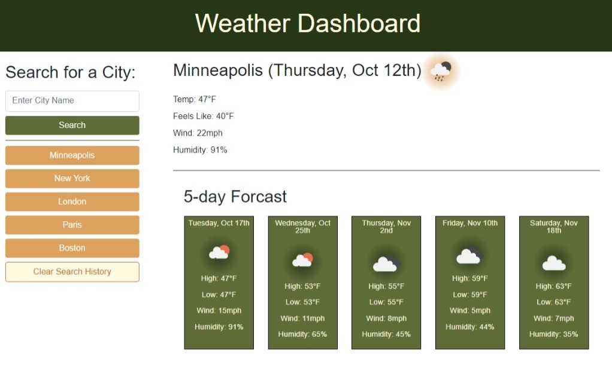

# Weather Dashboard

## Webpage Description
This is a weather dashboard application. It contains the following features:
- The user can searches for a city, they are presented with the current weather and 5-day forcast. 
- Current weather includes:
  - City Name
  - Today's Date
  - An icon representing the weather conditions
  - Current temp
  - Temp that it feels like
  - Humidity
- 5-day forcast includes:
  - Date
  - An icon representing the weather conditions
  - Temp
  - Wind Speed
  - Humidty
- The last 5 search cities are saved and shown as buttons on the left
- When a saved city is clicked on, it is moved to the top of the search history list and it's weather is displayed on the page
- If the user searches for a city already in their search history, no new button is generated but that city is moved to the top of the seach history
- If the user searches for a 6th city not already in their search history, the city at the bottom of the list (oldest search) is deleted
- If they enter a city that isn't in the system or isn't the name of a city, they'll recieve an alert that a city wasn't found.
- Upon refresh, the search cities are still avaliable unless cleared with the clear search history button
- Upon refresh, if there is a search history in local storage, the most recently searched city is loaded.

## Link to Website
The deployed website can be accessed [here](https://wald14.github.io/weather-dashboard/)

## Acknowledgements
- Gary Almes (Professor)
- [W3School](https://www.w3schools.com/)
- [MDN Web Docs](https://developer.mozilla.org/)
- [Stack Overflow](https://stackoverflow.com)
- [Open Weather API](https://openweathermap.org/api)
- Duckett, Jon. JavaScript &amp; JQuery: Interactive Front-End Web Development. John Wiley &amp; Sons, 2014. 
- Duckett, John. HTML &amp; CSS: Design and Build Websites. John Wiley and Sons, 2014. 

## Site Preview
The following image shares the web application's apperance:
 

